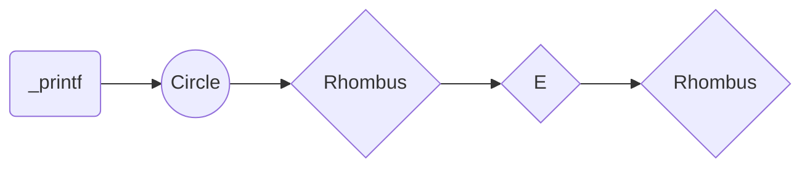

Holberton _printf project.

_printf - manual page

NAME

_printf - prints the string to standard output

SYNOPSIS

_printf FORMAT [ARGUMENT]...

DESCRIPTION

The function reads a string of characters with or without a specific format and then prints it to the standard output.

FORMAT OPTIONS

The formats that this function receives are:

%s : Print a string

%c : Print a character

%d : Print a number as a integer

%i : Print a number as a integer
RETURN VALUE 
Return the length of the string impressed.

EXAMPLE

Int main()

  {

    _printf(“%d”, 1024);
  
  }

Output:

	1024

Flowchard:

